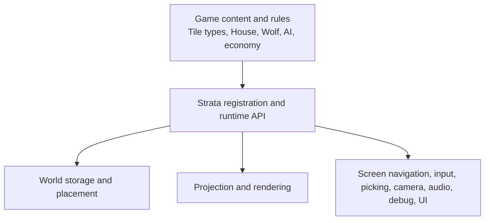
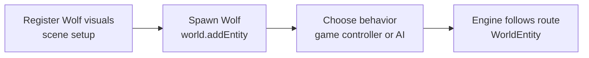
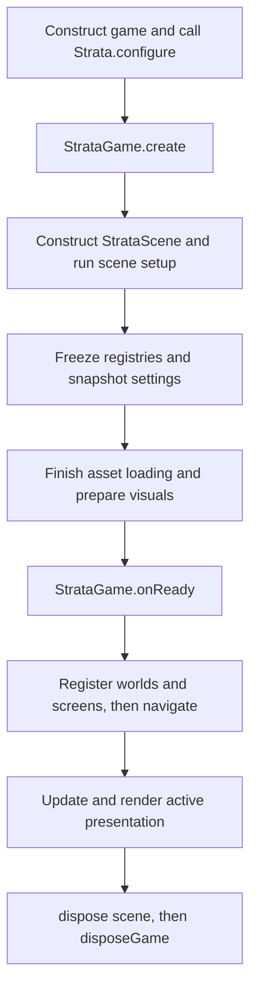

# Architecture

Strata supplies reusable isometric-world infrastructure. The game supplies meaning and policy. Keeping that line clear is the main design rule when building on the engine.



## Responsibilities

Strata owns isometric projection and rendering, the finite `World` container, terrain overlays, placement mechanics, entity spatial state and route following, caller-directed pathfinding, world-view management, screen navigation, input dispatch and picking, classpath asset loading, visual animation clocks, camera control, sound playback infrastructure, debug overlays, and UI primitives.

The game owns concrete `Tile`, `TerrainId`, `Placeable`, `Entity`, `SoundId`, `SoundCategoryId`, and `VisualStateId` implementations. It also owns terrain passability, build rules beyond geometric occupancy, AI, production, economy, weather, tool modes, and the meaning of states such as `IDLE`, `WALK`, `ON`, `OFF`, `WORKING`, or `RAINING`.

Strata can render a state chosen by the game, but it does not decide that a workshop is `WORKING` or a wolf is `IDLE`. The Sandbox's `WolfState` and `SandboxRoamingController` are application code, not engine concepts.

## Registration, instances, and behavior

These are separate phases:



- Registration tells a scene which assets and visual rules correspond to a game type. Registering `House` does not place one; registering `Wolf` does not spawn one.
- Instance creation changes a `World`: `world.place(House(), ...)` creates a `PlacedObject`, while `world.addEntity(Wolf(), ...)` creates a `WorldEntity`.
- Runtime behavior remains game policy. A controller may find a path and call `followPath`, but Strata does not schedule roaming, combat, or jobs.

Registries are keyed by exact terrain IDs or runtime Kotlin classes. Object and entity entries are kept in declaration order for menus and other game uses. Optional object factories mark entries as constructible; they are creation helpers, not world instances.

## Ownership model

| Value | Owner | Notes |
| --- | --- | --- |
| `Strata`, scene, registries, assets, world views, screen UIs, audio | Strata/game facade | Disposed through `StrataGame` |
| `World`, `Tile`, `Placeable`, `Entity` | Game | Registered worlds have no disposal lifecycle |
| `PlacedObject`, `WorldEntity` spatial wrappers | `World` | Returned as live runtime values; removal goes through `World` |
| Screen UI `Stage` and default `Skin` | Strata UI | Retained across navigation and disposed with the screen |
| Custom UI `Skin` and resources in it | Game | Dispose in game code |
| Game controllers and rules | Game | Update from `updateGame` as needed |

`Entity` is game-owned identity/data. `WorldEntity` is the engine-owned position, direction, and movement state for that entity. `Placeable` describes an object's footprint; `PlacedObject` combines one game object with its placement origin.

## Lifecycle



`Strata.configure` is one-shot. It captures process settings and one required scene specification. The scene block itself runs later, during `Strata.create()`.

During scene setup, register all content and configure audio, debug, camera, rendering, placement, and controls. At the end of the block, terrain, object, entity, and sound registries close. Camera, rendering, controls, and placement settings are copied. All queued assets then load synchronously and registered visuals are prepared.

After creation, `onReady()` registers game-owned worlds and logical screens. Every world registration creates a retained view, input processor, and optional placement controller. Screen UI is created lazily when first activated and retained across later navigation. The compatibility `attachWorld` and `createUi` APIs remain available for simple applications.

During each frame, Strata advances active-world entity movement with simulation time, updates the selected view and hover/placement state, updates visible screen UI with real time, and then calls the game update hooks. Rendering draws the selected world, visible screen UIs, compatibility UI, and debug UI in that order. Disposal uninstalls input, deactivates and disposes screens, disposes registered views, stops audio, disposes assets, and finally calls `disposeGame`.

## Real time and simulation time

`strata.simulation` controls world and game simulation without stopping the application loop:

```kotlin
strata.simulation.timeScale = 2f
strata.simulation.pause()
strata.simulation.resume()
```

`timeScale` accepts any positive finite value. Pause is separate, so pausing at `2f` and resuming continues at 2x. Entity movement and world visual animation use the scaled simulation delta. Camera control, input and hover, placement previews, Scene2D UI, rendering, and performance measurement use real frame time.

`StrataGame.updateRealTime(realDelta)` runs first for game-owned real-time work that must continue while paused. `StrataGame.updateGame(simulationDelta)` then receives scaled simulation time for AI, economy, production, and other game progression. Inactive logical worlds pause by default; `InactiveWorldPolicy.UPDATE` advances all registered worlds.

## Setup snapshots and runtime state

`EngineSettings.backgroundColor` is captured when `StrataEngine` is constructed. Scene camera, rendering, controls, and placement settings are setup-only snapshots copied into each registered world view. Registrations are setup-only.

Audio volumes/category volumes, `DebugSettings`, and `strata.simulation` are runtime mutable. Once attached, `PlacementController.enabled` and `selectedFactory`, `IsoWorldView.worldInputEnabled`, and the exposed `CameraController` runtime values can also change. The `World` is deliberately mutable at runtime.

Accessors such as `strata.scene`, `strata.world`, `strata.view`, and `strata.placement` require an active world. `strata.ui` refers to the compatibility UI created by `createUi`; screen UI is lifecycle-managed through `strata.screens`. Calling runtime accessors from the scene configuration lambda fails because runtime operations are unavailable during setup.

## Current boundaries

The current implementation has several concrete boundaries to design around:

- one `Strata` runtime defines one shared scene with many registered worlds and screens, one displayed world, and a visible screen stack;
- content registration closes during scene creation, and the built-in scene path loads queued assets synchronously before `onReady()`;
- pathfinding uses uniform-cost, edge-connected tiles and only the caller's `canEnter` rule;
- entities have continuous positions but no footprint, collision, occupancy, or generic AI system;
- terrain overlay layers can be added and edited, but not removed or reordered through public API;
- semantic states, gameplay tools, drag-building policy, and controller logic shown in Sandbox remain game-owned;
- the project publishes Maven-compatible modules locally but currently configures no remote artifact repository.

See [Configuration](Configuration.md), [World and Coordinates](World-and-Coordinates.md), and [UI](UI.md) for the concrete workflows.
