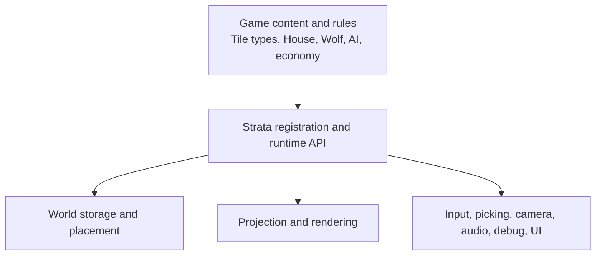
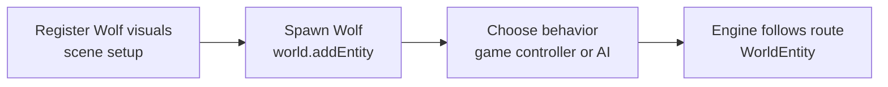
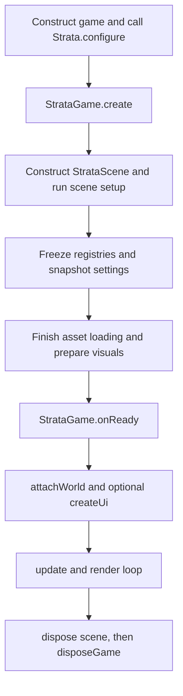

# Architecture

Strata supplies reusable isometric-world infrastructure. The game supplies meaning and policy. Keeping that line clear is the main design rule when building on the engine.

## Responsibilities

Strata owns isometric projection and rendering, the finite `World` container, terrain overlays, placement mechanics, entity spatial state and route following, caller-directed pathfinding, input dispatch and picking, classpath asset loading, visual animation clocks, camera control, sound playback infrastructure, debug overlays, and UI primitives.

The game owns concrete `Tile`, `TerrainId`, `Placeable`, `Entity`, `SoundId`, `SoundCategoryId`, and `VisualStateId` implementations. It also owns terrain passability, build rules beyond geometric occupancy, AI, production, economy, weather, tool modes, and the meaning of states such as `IDLE`, `WALK`, `ON`, `OFF`, `WORKING`, or `RAINING`.

Strata can render a state chosen by the game, but it does not decide that a workshop is `WORKING` or a wolf is `IDLE`. The Sandbox's `WolfState` and `SandboxWolfController` are application code, not engine concepts.

## Registration, instances, and behavior

These are separate phases:

- Registration tells a scene which assets and visual rules correspond to a game type. Registering `House` does not place one; registering `Wolf` does not spawn one.
- Instance creation changes a `World`: `world.place(House(), ...)` creates a `PlacedObject`, while `world.addEntity(Wolf(), ...)` creates a `WorldEntity`.
- Runtime behavior remains game policy. A controller may find a path and call `followPath`, but Strata does not schedule roaming, combat, or jobs.

Registries are keyed by exact terrain IDs or runtime Kotlin classes. Object and entity entries are kept in declaration order for menus and other game uses. Optional object factories mark entries as constructible; they are creation helpers, not world instances.

## Ownership model

| Value | Owner | Notes |
| --- | --- | --- |
| `Strata`, scene, registries, assets, view, audio | Strata/game facade | Disposed through `StrataGame` |
| `World`, `Tile`, `Placeable`, `Entity` | Game | A scene attaches one world; `World` has no disposal lifecycle |
| `PlacedObject`, `WorldEntity` spatial wrappers | `World` | Returned as live runtime values; removal goes through `World` |
| UI `Stage` | Strata UI | Disposed with the scene |
| UI `Skin` and resources in it | Game | Dispose in game code |
| Game controllers and rules | Game | Update from `updateGame` as needed |

`Entity` is game-owned identity/data. `WorldEntity` is the engine-owned position, direction, and movement state for that entity. `Placeable` describes an object's footprint; `PlacedObject` combines one game object with its placement origin.

## Lifecycle

`Strata.configure` is one-shot. It captures process settings and one required scene specification. The scene block itself runs later, during `Strata.create()`.

During scene setup, register all content and configure audio, debug, camera, rendering, placement, and controls. At the end of the block, terrain, object, entity, and sound registries close. Camera, rendering, controls, and placement settings are copied. All queued assets then load synchronously and registered visuals are prepared.

After creation, `onReady()` can attach one world and create one UI. A world attachment creates its view, input processor, and optional placement controller. `createUi` may happen before or after world attachment, but only after scene setup finishes.

During each frame, Strata advances entity movement, updates the view and hover/placement state, updates the UI, and then calls `updateGame`. Rendering draws the world first and UI second. Disposal uninstalls input, disposes UI and the view, stops audio, disposes assets, and finally calls `disposeGame`.

## Setup snapshots and runtime state

`EngineSettings.backgroundColor` is captured when `StrataEngine` is constructed. Scene camera, rendering, controls, and placement settings are setup-only snapshots used when the world is attached. Registrations are setup-only.

Audio volumes/category volumes and `DebugSettings` are runtime mutable. Once attached, `PlacementController.enabled` and `selectedFactory`, `IsoWorldView.worldInputEnabled`, and the exposed `CameraController` runtime values can also change. The `World` is deliberately mutable at runtime.

Accessors such as `strata.scene`, `strata.world`, `strata.view`, `strata.placement`, and `strata.ui` require their corresponding runtime object to exist. Calling them from the scene configuration lambda fails because runtime operations are unavailable during setup. Use the setup receiver there, and use the facade from `onReady()` onward.

See [Configuration](Configuration.md), [World and Coordinates](World-and-Coordinates.md), and [UI](UI.md) for the concrete workflows.

