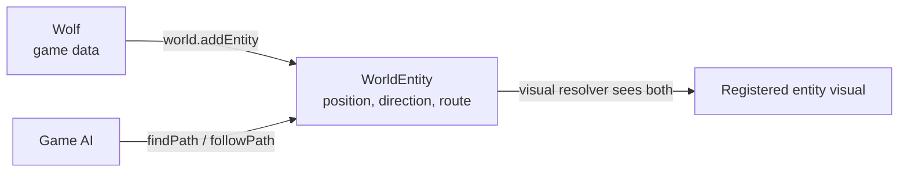

# Entities

Entities are independent movable values. The game supplies an `Entity`; `World.addEntity` wraps it in a `WorldEntity` containing engine-owned spatial state.

```kotlin
class Wolf : Entity

val runtimeWolf = world.addEntity(
    entity = Wolf(),
    position = EntityPosition.centerOf(TilePosition(8, 6)),
    direction = EntityDirection.SOUTH_EAST
)
```

`Entity` is identity/data and may contain any game fields. `WorldEntity` owns:

- continuous `position` and derived `currentTile`;
- current `direction`;
- route state exposed by `isMoving` and nullable `movementSpeed`;
- snapshot lists `remainingWaypoints` and `remainingPath`.

The initial direction defaults to `SOUTH_EAST`. Entities do not occupy tiles, have no `Footprint`, and do not block objects or other entities. `World.addEntity` does not validate bounds.

## Register visuals

```kotlin
registrations {
    entities {
        register<Wolf>("wolf.png") {
            scale = 1f
            offsetY = 0f
        }
    }
}
```

Registration maps the game entity's exact Kotlin class to a visual. It does not spawn an instance. Entity sprite settings are `offsetX`, `offsetY`, optional world-unit `width`/`height`, and `scale`. Entity sprites are anchored bottom-center at their continuous position.

Entities support static/animated sources, directional visuals, and state → direction visuals. See [Visuals and Animation](Visuals-and-Animation.md).

## Runtime operations

```kotlin
runtimeWolf.face(EntityDirection.NORTH_WEST)
runtimeWolf.teleport(EntityPosition(10.5f, 9.5f))

val removed = world.removeEntity(runtimeWolf)
```

`face` changes direction immediately; active movement may change it again on the next update. `teleport` changes position and cancels the current route. `removeEntity` returns `false` when the wrapper is not in that world.

`getEntities()` is a read-only live view, and `entityVersion` changes when entities are added or removed. Position/movement changes do not increment `entityVersion`.

Strata updates movement before `StrataGame.updateGame(delta)`. A game controller can therefore observe completed routes in its update and choose the next action. The Sandbox `SandboxEntitySpawner` and `SandboxWolfController` demonstrate this split: one creates a wolf, the other decides when and where it roams.

## Identity and ownership



Keep the returned `WorldEntity` when a controller needs to command or inspect that specific runtime instance. Do not try to cast it to the game entity; use `runtimeWolf.entity as Wolf` when the typed data is needed.

See [Movement and Pathfinding](Movement-and-Pathfinding.md), [Visuals and Animation](Visuals-and-Animation.md), and [Input and Picking](Input-and-Picking.md).
