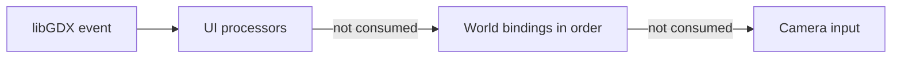

# Input and picking

World input is configured as an ordered list of bindings. Each binding combines a trigger, an optional runtime predicate, a picking strategy, and a Boolean action. Returning `true` consumes the event and stops later bindings and camera processing for that event.



UI processors are installed before the world processor. Inside the world view, gameplay bindings run before camera drag/scroll handling.

## Triggers

Current `WorldInputTrigger` variants are:

```kotlin
WorldInputTrigger.MouseDown(Input.Buttons.LEFT)
WorldInputTrigger.MouseDrag(Input.Buttons.LEFT)
WorldInputTrigger.MouseUp(Input.Buttons.LEFT)
WorldInputTrigger.KeyDown(Input.Keys.P)
```

The world processor remembers pressed buttons per pointer so drag and release triggers retain the original button. A binding's `enabled: () -> Boolean` predicate is evaluated when a matching event occurs.

`ControlsSettings` is snapshotted during scene creation:

```kotlin
controls {
    gameplay {
        bindings = gameInputBindings()
    }
}
```

It is often cleaner to keep application bindings in a dedicated file, as the Sandbox does in `sandbox/input/SandboxInputBindings.kt`. Provider lambdas let bindings refer to controllers created later in `onReady()` without touching them during configuration.

## Binding kinds

### Tile

`Tile` calls the action only when the pointer resolves to an actual ground tile inside the finite world:

```kotlin
WorldInputBinding.Tile(
    trigger = WorldInputTrigger.MouseDown(Input.Buttons.LEFT),
    enabled = { toolMode == ToolMode.PAINT }
) { x, y ->
    paint(TilePosition(x, y))
}
```

### Grid

`Grid` always supplies a logical grid coordinate, including positions outside the attached world:

```kotlin
WorldInputBinding.Grid(
    trigger = WorldInputTrigger.MouseDrag(Input.Buttons.LEFT),
    enabled = { drag.active }
) { x, y ->
    drag.update(TilePosition(x, y))
}
```

This distinction is essential for drag gestures. Start with `Tile` when a gesture must begin inside the world; use `Grid` for drag/up so it can update or finish after the cursor crosses the boundary. The Sandbox uses this pattern for painting and rectangular building.

### Object

```kotlin
WorldInputBinding.Object(
    trigger = WorldInputTrigger.MouseDown(Input.Buttons.RIGHT),
    mode = ObjectPickingMode.SPRITE_OR_FOOTPRINT
) { placed ->
    world.remove(placed)
    true
}
```

Object modes are:

| Mode | Behavior |
| --- | --- |
| `FOOTPRINT` | Pick the object occupying the finite tile under the pointer |
| `SPRITE_ALPHA` | Pick the frontmost visible object whose current sprite pixel is solid |
| `SPRITE_OR_FOOTPRINT` | Try sprite alpha, then footprint |
| `NONE` | Always produce no object |

### Entity

```kotlin
WorldInputBinding.Entity(
    trigger = WorldInputTrigger.MouseDown(Input.Buttons.LEFT),
    mode = EntityPickingMode.SPRITE_ALPHA
) { worldEntity ->
    select(worldEntity)
    true
}
```

Entity modes are `SPRITE_ALPHA` and `NONE`. Entities have no footprint-picking mode because they do not occupy tiles.

### NoPicking

`NoPicking` invokes an action without resolving a target. It is useful for keyboard shortcuts and cleanup that must run even when a mouse release is outside the world:

```kotlin
WorldInputBinding.NoPicking(
    trigger = WorldInputTrigger.MouseUp(Input.Buttons.LEFT),
    enabled = { painter.active }
) {
    painter.finish()
}
```

## Consumption and ordering

Bindings with the same trigger are checked in list order. Disabled bindings and failed picks continue to the next binding. A picked action returning `false` also continues. Return `true` only when the game handled the event.

This lets a sprite-level entity selection run before a tile action on the same left click. If the entity action returns `false`, tile picking can still handle the event.

Set `strata.view.worldInputEnabled = false` to disable all world bindings. This clears tracked mouse-button state. Camera input is a separate processor; disable it through `strata.view.cameraController.enabled` or its control flags if needed.

## Direct picking

The attached view exposes:

```kotlin
val tile: TilePosition? = strata.view.pickTile(screenX, screenY)
val grid: TilePosition = strata.view.pickGrid(screenX, screenY)
val placed: PlacedObject? = strata.view.pickObject(
    screenX,
    screenY,
    ObjectPickingMode.SPRITE_ALPHA
)
val entity: WorldEntity? = strata.view.pickEntity(
    screenX,
    screenY,
    EntityPickingMode.SPRITE_ALPHA
)
```

Sprite picking walks the current front-to-back render order, checks rendered bounds, and uses the alpha mask for the active state, direction, and animation frame. Alpha values of at least 16/255 count as solid. Missing visuals cannot be sprite-picked. Object `FOOTPRINT` remains available even if no visual is registered.

See [World and Coordinates](World-and-Coordinates.md), [Placement](Placement.md), and [Assets](Assets.md).
