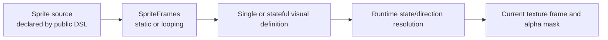
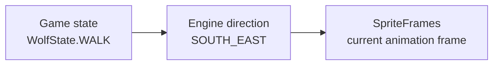

# Visuals and animation

Terrain, objects, and entities share one visual model. The internal preparation pipeline is:



The concrete `SpriteSource` and prepared-definition types are internal. Game code declares them through `sprite`, `animated`, `spriteSheet`, `atlas`, and `animatedAtlas` builder calls. See [Assets](Assets.md) for path and sheet rules.

## Static and animated visuals

Convenience registrations cover common cases:

```kotlin
register<House>(sprite = "house.png")

registerAnimated<Campfire>(
    frames = listOf("fire-0.png", "fire-1.png", "fire-2.png"),
    frameDuration = 0.1f
)
```

A static visual has one frame. All animations loop. The scene owns one increasing animation clock; simple animations use it directly.

## Stateful visuals

`VisualStateId` is a marker for game-owned state identifiers:

```kotlin
enum class WorkshopState : VisualStateId {
    IDLE,
    WORKING
}
```

Register every possible result of `stateFor` during setup:

```kotlin
registerStateful<Workshop>(
    stateFor = { _, workshop -> workshop.state }
) {
    state(WorkshopState.IDLE) {
        sprite("workshop-idle.png")
    }
    state(WorkshopState.WORKING) {
        spriteSheet(
            path = "workshop-working.png",
            frameWidth = 64,
            frameHeight = 96,
            frameDuration = 0.1f
        )
    }
}
```

The resolver runs at runtime. Missing states fail instead of loading assets late. Strata compares state IDs but assigns no semantic meaning to `IDLE`, `WORKING`, or any other name.

## Playback clocks

`VisualPlayback.LOCAL` restarts a state's animation from frame zero when that runtime identity enters the state. `SYNCHRONIZED` uses the scene clock, keeping every user of that state on the same frame schedule. The scene clock advances with `strata.simulation`, so pausing freezes world visuals and changing `timeScale` changes their playback speed. Camera and UI timing remain unscaled.

Object and entity state builders default to `LOCAL`; terrain states default to `SYNCHRONIZED`. Override a state when needed:

```kotlin
state(
    id = WorkshopState.WORKING,
    playback = VisualPlayback.SYNCHRONIZED
) {
    spriteSheet("working.png", 64, 96, 0.1f)
}
```

State transitions are observed when the visual is resolved for rendering/picking. Local playback state is tracked by runtime identity. Objects use the underlying `Placeable` identity; entities use the `WorldEntity` identity.

## Directional entity visuals

Direction is engine-owned spatial state. Semantic state is game-owned. Resolution for a stateful directional entity is:



For direction alone, use `registerDirectional` and define either the four diagonal base directions or all eight directions:

```kotlin
registerDirectional<Guard> {
    direction(EntityDirection.NORTH_EAST) { sprite("guard-ne.png") }
    direction(EntityDirection.SOUTH_EAST) { sprite("guard-se.png") }
    direction(EntityDirection.SOUTH_WEST) { sprite("guard-sw.png") }
    direction(EntityDirection.NORTH_WEST) { sprite("guard-nw.png") }
}
```

Each direction may use any common static or animated source. A four-direction registration is valid for all runtime directions: `NORTH`, `EAST`, `SOUTH`, and `WEST` fall back clockwise to `NORTH_EAST`, `SOUTH_EAST`, `SOUTH_WEST`, and `NORTH_WEST`. Define all eight when the art has screen-cardinal facings.

## Stateful directional sprite sheets

The Sandbox wolf derives game state from engine movement and then selects a direction-specific row:

```kotlin
enum class WolfState : VisualStateId { IDLE, WALK }

registerStateful<Wolf>(
    stateFor = { entity ->
        if (entity.isMoving) WolfState.WALK else WolfState.IDLE
    },
    configure = {
        offsetY = -24f
    }
) {
    state(WolfState.IDLE) {
        directionalSpriteSheet(
            path = "wolf/wolf-idle.png",
            frameWidth = 64,
            frameHeight = 64,
            frameDuration = 0.2f,
            framesPerDirection = 4,
            directionRows = DIRECTION_ROWS
        )
    }

    state(WolfState.WALK) {
        directionalSpriteSheet(
            path = "wolf/wolf-run.png",
            frameWidth = 64,
            frameHeight = 64,
            frameDuration = 0.1f,
            framesPerDirection = 8,
            directionRows = DIRECTION_ROWS
        )
    }
}

val DIRECTION_ROWS = mapOf(
    EntityDirection.SOUTH_WEST to 0,
    EntityDirection.SOUTH_EAST to 1,
    EntityDirection.NORTH_WEST to 2,
    EntityDirection.NORTH_EAST to 3
)
```

`directionRows` must contain either the four diagonal base directions or all eight `EntityDirection` values, with distinct non-negative rows. Sheet dimensions must divide by frame dimensions. If `framesPerDirection` is supplied, it must equal the number of columns in each row; it does not truncate a longer row.

Within `EntityStatefulVisualBuilder.state`, a state may define one non-directional source, four or eight individual directions, or one directional sheet. These forms cannot be mixed in the same state.

`EntitySpriteSettings.representativeDirection` selects a stable facing for menus and Debug Spawn previews. A stateful registration can similarly call `representativeState(...)`; each defaults to the first suitable registered choice when omitted.

## Registry access caveat

`TerrainEntry.sprite`, `ObjectEntry.visual`, and `EntityEntry.visual` are single-visual conveniences. They reject stateful registrations; the entity convenience also rejects directional registrations. Runtime rendering uses the appropriate `resolve(...)` path. Game UI should use `ObjectEntry.selectionVisual` for constructible object choices.

See [Rendering](Rendering.md), [Objects](Objects.md), and [Entities](Entities.md).
