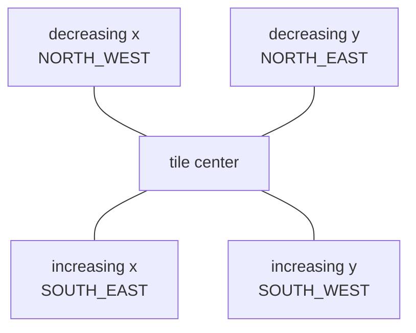

# World and coordinates

`World` is a finite rectangular container for ground tiles, terrain overlays, placed objects, and movable entities. The game creates and owns it; Strata attaches one world to a scene and renders it.

## Create a world

```kotlin
val world = World(width = 50, height = 50) { x, y ->
    val terrain = if (x in 12..18 && y in 12..18) {
        TerrainType.WATER
    } else {
        TerrainType.LOW_GRASS
    }
    SandboxTile(terrain)
}
```

Width and height must be positive. The tile factory is called once for every coordinate, in row-major construction order. Ground cells always contain a `Tile`; `getTile` returns `null` only when a coordinate is outside the finite world.

Attach the world after scene creation:

```kotlin
strata.attachWorld(
    world = world,
    terrainFor = { tile ->
        (tile as SandboxTile).terrain
    }
)
```

A scene accepts one world attachment. Attaching creates the isometric view, world input, and the placement controller if `placement {}` was configured.

## Discrete and continuous positions

`TilePosition(x: Int, y: Int)` is a discrete logical grid coordinate. It may describe a coordinate outside the world; use `world.contains(position)` or `world.getTile(position) != null` when bounds matter.

`EntityPosition(x: Float, y: Float)` is continuous logical tile space. Integer coordinates lie on tile boundaries, so the center of tile `(x, y)` is `(x + 0.5f, y + 0.5f)`:

```kotlin
val tile = TilePosition(4, 7)
val center = EntityPosition.centerOf(tile) // (4.5, 7.5)
val containingTile = center.tile           // TilePosition(4, 7)
```

`EntityPosition.tile` floors each coordinate. This also matters for negative positions: `-0.1f` belongs to tile `-1`, not tile `0`. Coordinates must be finite.

`World.addEntity` does not enforce world bounds. This permits continuous off-world state, but game code must keep entities inside the desired area. Pathfinding, by comparison, requires its start and goal inside the world.

## The isometric plane

Logical axes remain an ordinary square grid even though they appear diagonally:



Increasing `x` projects down-right; increasing `y` projects down-left. Strata uses a 2:1 diamond top face: the face width is `TileGeometry.width`, and face height is always half that width. `TileGeometry.height` is the full logical terrain sprite height and must be at least the face height.

Screen coordinates are window/input pixels. World coordinates are the orthographic camera's projected drawing plane. Logical tile coordinates are the square-grid values described above. `IsoWorldView.pickGrid` handles screen → world → logical-grid conversion. `pickTile` adds the finite-world bounds check.

## Bounds and queries

Useful world calls and extensions include:

```kotlin
world.getTile(3, 4)
world.contains(TilePosition(3, 4))
world.neighbors(TilePosition(3, 4))
world.neighbors(TilePosition(3, 4), includeDiagonals = true)
world.positionsIn(0..5, 0..5)
world.forEachTile { position, tile -> /* ... */ }
```

`neighbors` requires an in-world origin and returns only in-world positions. It defaults to four edge-connected neighbors. `positionsIn` clips the requested rectangle to world bounds. These helpers do not apply terrain, object, or game movement rules.

The camera derives bounds from the finite world, configured padding, logical tile geometry, and the maximum terrain sprite height. Logical grid picking can still return coordinates beyond those bounds when the cursor projects there; this is useful for finishing drag interactions outside the world.

See [Terrain](Terrain.md), [Objects](Objects.md), [Entities](Entities.md), and [Input and Picking](Input-and-Picking.md).

